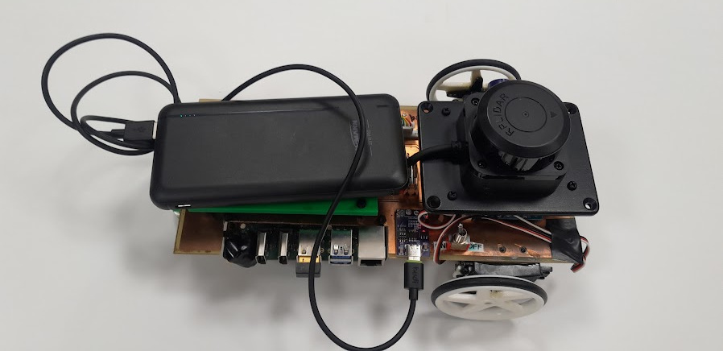
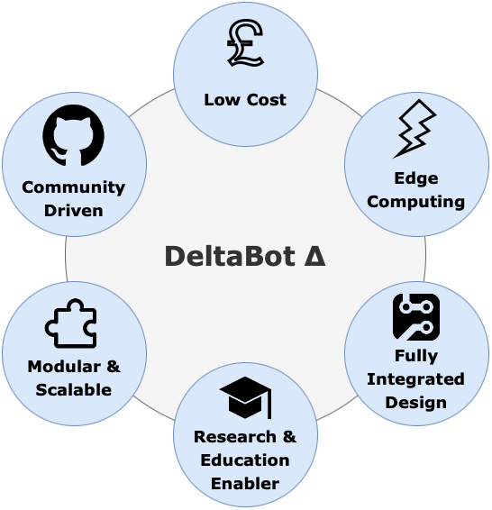
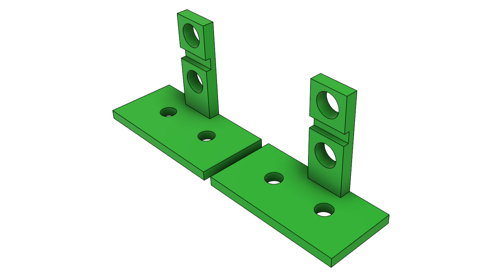
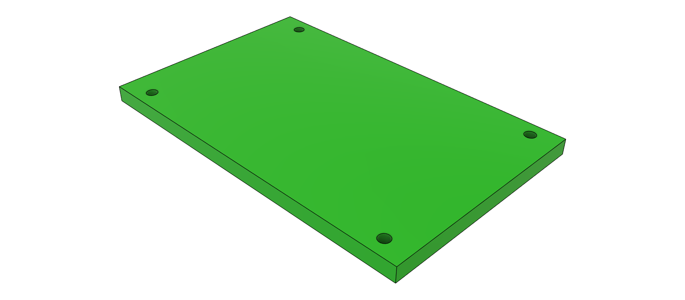
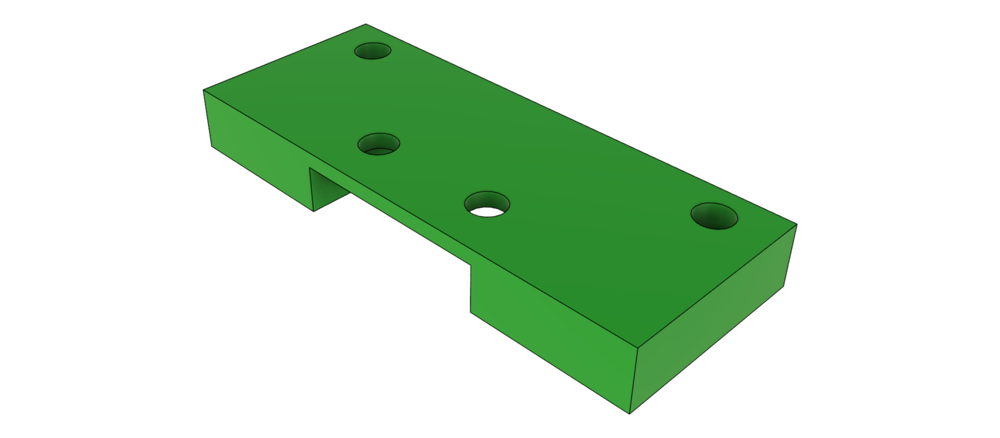

# The Delta Bot

## What is the Delta Bot?
The Delta Bot is an open-source DIY robot AI platform that uses Radxa's single board computer, the [Rock 5B](https://radxa.com/products/rock5/5b/), and Parallax's [Continuous Rotation Servo Motors](https://www.parallax.com/product/parallax-continuous-rotation-servo-factory-centered/).

Optionally you can add the C1 LIDAR to the robot: https://github.com/berndporr/c1lidar and of course any compatible camera.

<p align="center">
  
  
</p>

## Hardware

### Schematics
- For the list of components used refer to [BOM.md](BOM.md).
- For details on the DeltaBot schematic, pcb, and footprint library refer to [PCB.md](PCB.md).

### Additional Mechanical Parts
Additional Mechanical Parts were designed in CAD and can be accessed [here](additional_files/deltabot.f3z).
These were used to secure the external components onto the Single PCB Chassis:
<p align="center">
  
  
  
</p>

## Software

### Install ARMbian

Download from
https://www.armbian.com/rock-5b/
the image "Armbian 25.8.2 Bookworm Minimal / IOT".
the 
Call `armbian-config`:
  - upgrade to Debian "trixie"
  - Make sure you have kernel 26.2.1 Armbian Linux vendor headers 6.1.115-vendor-rk35xx

### Enabling PWM drivers and UART in armbianEnv.txt

Start `sudo nano /boot/armbianEnv.txt`, identify these lines and add/edit them that
they look like these:

```
console=display
overlay_prefix=
overlays=rk3588-pwm14-m0 rk3588-pwm8-m0 rk3588-uart2-m0
```

This enables the UART and PWM on the pins 33 and 34 on the 40 pin header.

Create the group `gpio`:

```
groupadd gpio
```
and add yourself and other users to it who want to write to the PWM device.

Copy the file [90-gpio.rules](90-gpio.rules) to `/etc/udev/rules.d/`. This will
make sure that the PWM can accessed by any user who's in the gpio group.

### Raspberry PI V2 Cameras

The 1st RPI V2 camera has already a device overlay (`rock-5b-rpi-camera-v2`). The device overlay for the 2nd camera
needs to be compiled from source:

```
cpp -nostdinc -I /usr/src/linux-headers-6.1.115-vendor-rk35xx/include/ -undef -x assembler-with-cpp rock-5b-plus-cam1-rpi-camera-v2.dts > cam1.dts
dtc -@ -I dts -O dtb -o /tmp/rock-5b-plus-cam1-rpi-camera-v2.dtbo cam1.dts
cp /tmp/rock-5b-plus-cam1-rpi-camera-v2.dtbo /boot/dtb-6.1.115-vendor-rk35xx/rockchip/overlay/
```

Add this to the overlays in `armbianEnv.tex`:
```
overlays=rk3588-pwm14-m0 rk3588-pwm8-m0 rk3588-uart2-m0 rock-5b-rpi-camera-v2 rock-5b-plus-cam1-rpi-camera-v2
```

and reboot.

If all goes well both cameras will show up as:

```
rkcif (platform:rkcif-mipi-lvds2):
	/dev/video0
	/dev/video1
	/dev/video2
	/dev/video3
	/dev/video4
	/dev/video5
	/dev/video6
	/dev/video7
	/dev/video8
	/dev/video9
	/dev/video10
	/dev/media0

rkcif (platform:rkcif-mipi-lvds4):
	/dev/video11
	/dev/video12
	/dev/video13
	/dev/video14
	/dev/video15
	/dev/video16
	/dev/video17
	/dev/video18
	/dev/video19
	/dev/video20
	/dev/video21
	/dev/media1
```

## Credits
- Saleh AlMulla - 2721704A@student.gla.ac.uk
- Bernd Porr -  bernd.porr@glasgow.ac.uk
- Yixuan Zha - 2974642Z@student.gla.ac.uk
