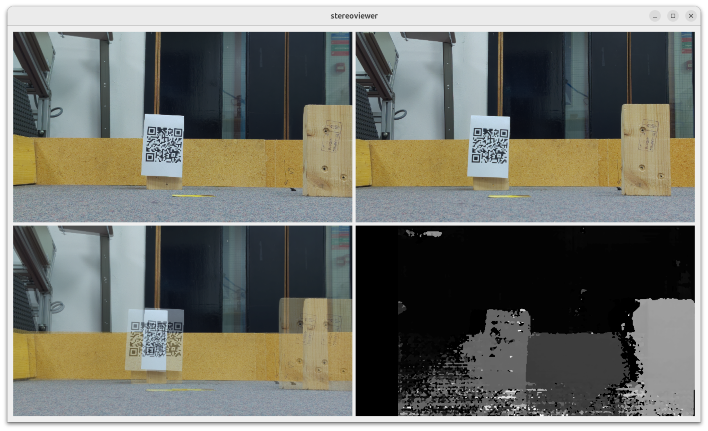

# Stereoviewer



Simple QT6 demo application which captures from both cameras and then calculates
the disparity map.

## Prerequisites

```
apt install libopencv-dev libcamera-dev libturbojpeg0-dev
```

## Compilation

```
cmake .
make
```

## How to run

```
./stereoviewer
```
